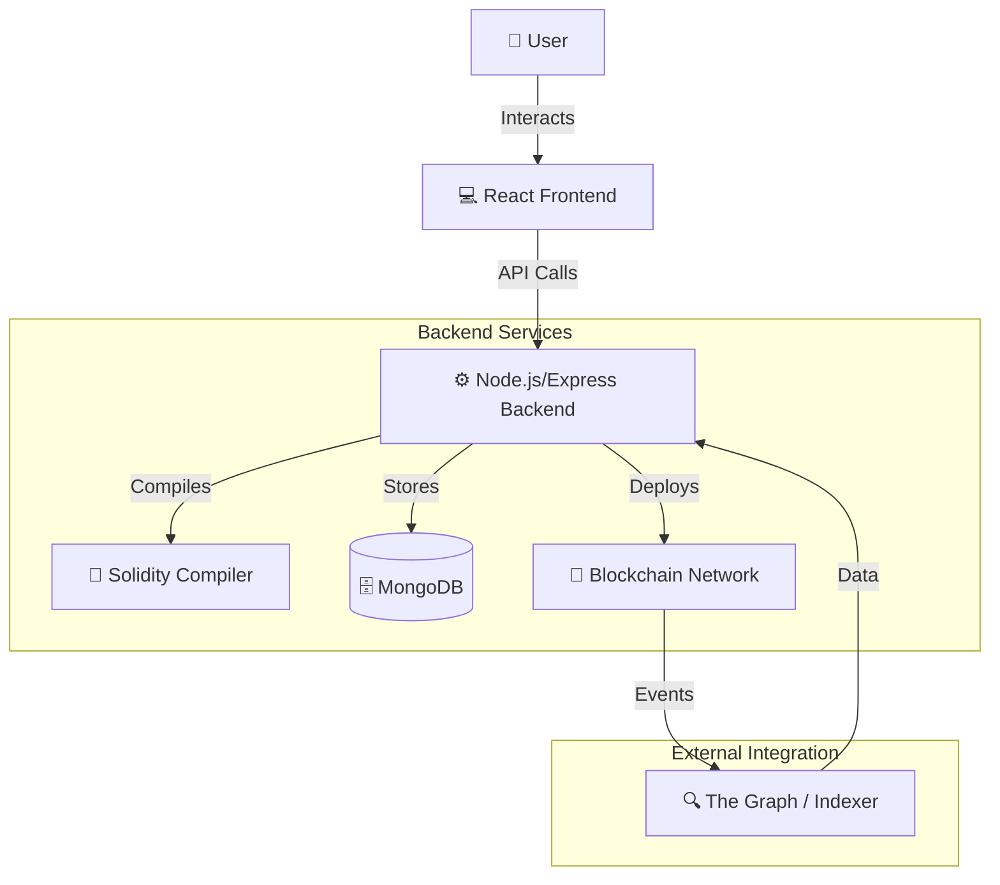
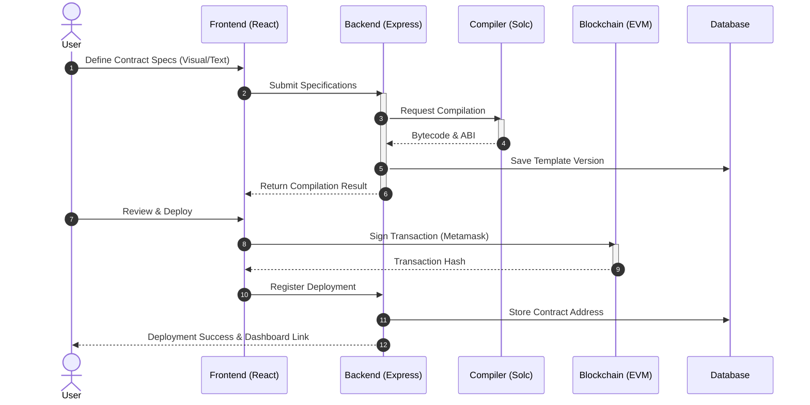
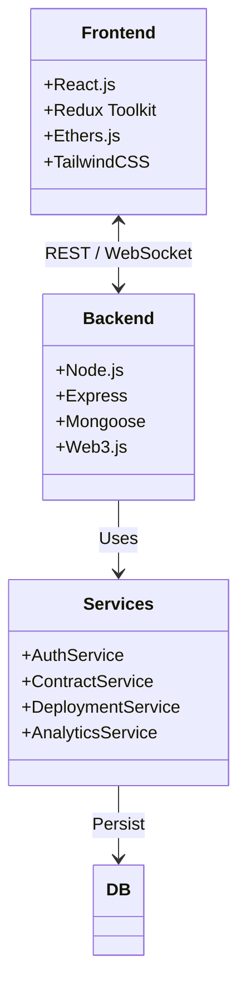

# SCGen: Next-Generation Smart Contract Generator

<div align="center">
  
  <h1>SCGen</h1>
  <p><strong>Limitless Smart Contract Generation & Real-time Visualization</strong></p>
  
  [](https://nodejs.org/)
  [](https://reactjs.org/)
  [](https://docs.soliditylang.org/)
  [](LICENSE)
</div>

---

## 📖 Introduction

**SCGen** is a state-of-the-art platform designed to democratize smart contract development. By bridging the gap between complex blockchain logic and intuitive user interfaces, SCGen allows developers and businesses to generate, visualize, and deploy smart contracts across multiple blockchains seamlessly.

Whether you are building a simple token or a complex decentralized finance (DeFi) protocol, SCGen's visual editor and automated code generation engine ensure security, efficiency, and scalability.

## 🚀 Key Features

*   **🤖 AI-Driven Generation**: Generate secure Solidity code from natural language descriptions or visual templates.
*   **📊 Real-time Visualization**: See your contract's logic flow and state changes instantly with our interactive visualizer.
*   **⚡ Multi-Chain Deployment**: One-click deployment to Ethereum, Binance Smart Chain, Polygon, and custom RPCs.
*   **🛡️ Automated Auditing**: Integrated security scanners check for common vulnerabilities (Reentrancy, Overflow, access control).
*   **📈 Analytics Dashboard**: Monitor contract interactions, gas usage, and events in real-time.

---

## 🏗️ Architecture

SCGen follows a modern microservices architecture, utilizing a robust backend for compilation and state management, and a reactive frontend for the best user experience.

### System Overview



### Application Flow

The following sequence diagram illustrates the flow from a user request to contract deployment:



### Component Structure



---

## 🛠️ Technology Stack

| Area | Technologies |
|------|--------------|
| **Frontend** | React 18, TailwindCSS, Framer Motion, D3.js, Ethers.js |
| **Backend** | Node.js, Express, MongoDB, Hardhat |
| **Blockchain** | Solidity 0.8+, Web3.js, IPFS |
| **DevOps** | Docker, Nginx, PM2, GitHub Actions |

---

## 🏁 Getting Started

### Prerequisites

*   Node.js v16+
*   MongoDB
*   Metamask installed in browser

### Installation

1.  **Clone the repository**
    ```bash
    git clone https://github.com/MrDecryptDecipher/SCGen.git
    cd SCGen
    ```

2.  **Install Dependencies**
    ```bash
    # Install root, frontend, and backend dependencies
    npm run install:all
    ```

3.  **Environment Setup**
    Create a `.env` file in the root directory:
    ```env
    PORT=3000
    MONGO_URI=mongodb://localhost:27017/scgen
    JWT_SECRET=your_super_secret_key
    ```

4.  **Run the Application**
    ```bash
    npm run dev
    ```
    *   Frontend running on: `http://localhost:3000`
    *   Backend running on: `http://localhost:3001` (or configured port)

---

## 🤝 Contributing

We welcome contributions! Please follow these steps:

1.  Fork the Project
2.  Create your Feature Branch (`git checkout -b feature/AmazingFeature`)
3.  Commit your Changes (`git commit -m 'Add some AmazingFeature'`)
4.  Push to the Branch (`git push origin feature/AmazingFeature`)
5.  Open a Pull Request

## 📄 License

Distributed under the MIT License. See `LICENSE` for more information.

---

<div align="center">
  <p>Built with ❤️ by <strong>MrDecryptDecipher</strong></p>
</div>